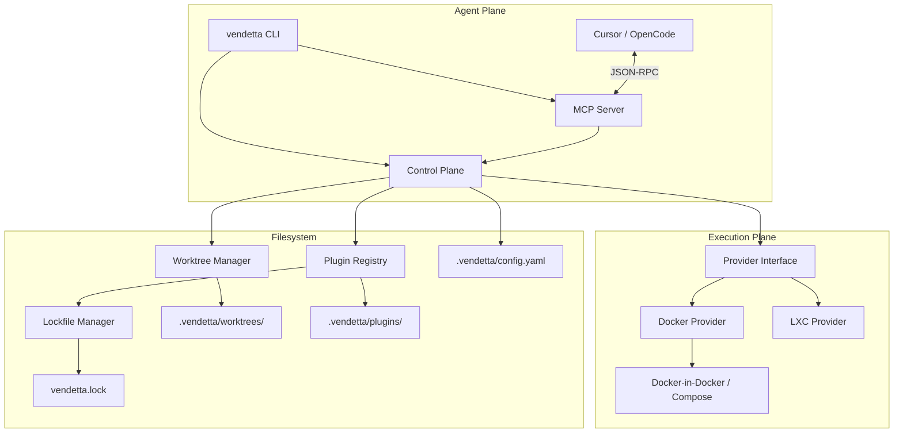

# Technical Architecture: Project vendetta

## 1. Overview
vendetta is a developer-centric, single-binary dev environment manager. It abstracts complex infrastructure (Docker, LXC, Worktrees) into a simple CLI interface, providing isolated, reproducible, and agent-friendly codespaces.

## 2. Component Diagram

## 3. Core Modules

### **Control Plane (`pkg/ctrl`)**
The central coordinator. It is responsible for:
- Parsing `.vendetta/config.yaml`.
- Orchestrating the sequence: `Plugin Resolve` -> `Worktree Create` -> `Provider Create` -> `Setup Hook` -> `Agent Gateway`.
- Maintaining session state through Docker labels and filesystem markers.

### **Plugin Registry (`pkg/plugins`)**
Manages the lifecycle of namespaced capabilities.
- **Discovery**: Recursively scans `.vendetta/plugins/` for local capabilities.
- **Resolution**: Builds a Directed Acyclic Graph (DAG) of dependencies.
- **Parallel Fetching**: Uses Go routines to pull remote plugins simultaneously.

### **Lockfile Manager (`pkg/lock`)**
Ensures environment reproducibility (inspired by `uv`).
- **Determinism**: Freezes plugin versions and Git SHAs in `vendetta.lock`.
- **Integrity**: Verifies checksums of fetched plugins to prevent supply-chain tampering.
- **Speed**: Enables immediate parallel cloning by skipping remote branch resolution.

### **Provider Interface (`pkg/provider`)**
An abstraction layer for environment lifecycles.
- **Methods**: `Create`, `Start`, `Stop`, `Destroy`, `Exec`, `List`.
- **MVP Implementation**: `DockerProvider` with DinD support and absolute path bind-mounting.

### **Worktree Manager (`pkg/worktree`)**
Automates the management of `git worktree`.
- Ensures that every dev session has a clean, isolated filesystem.
- Maps the worktree directory into the provider's execution context.

### **Agent Gateway (`pkg/agent`)**
Implements the **Model Context Protocol (MCP)**.
- **Tools**: `exec` (primary), `read_file`, `write_file` (via CP).
- **Interoperability**: Designed to be the standard interface for Cursor-agent, OpenCode, and Claude.

## 4. Environment Injection & Networking
vendetta solves the API discovery problem by injecting environment variables:
- **Port Discovery**: Host-mapped ports are discovered dynamically.
- **Injection**: Variables like `vendetta_SERVICE_[NAME]_URL` are passed to the container, allowing seamless CORS and endpoint configuration.

## 5. Agent Scaffold
The `.vendetta/agents/` directory acts as the **Single Source of Truth** for agent behavior.
- **Rules**: Markdown-based instructions.
- **Skills**: YAML tool definitions.
- **Sync**: CLI command `sync-agents` generates agent-specific configurations (e.g., `.cursorrules`).

## 6. Remote Repository Management
vendetta provides native CLI commands for advanced multi-remote Git operations:
- **Remote Sync**: `vendetta remote sync <target>` syncs `.vendetta` directory to a configured remote target.
- **Config-Driven Sync**: `vendetta remote sync-all` syncs `.vendetta` to all targets defined in `.vendetta/config.yaml` under `sync_targets`.
- **Implementation**: Uses Go `exec.Command` for Git operations with comprehensive error handling.
- **Use Case**: Rare scenarios requiring synchronization of `.vendetta` configs to additional repositories.

This ensures users never need direct Git commands for remote management while maintaining standard Git workflows for normal operations.
